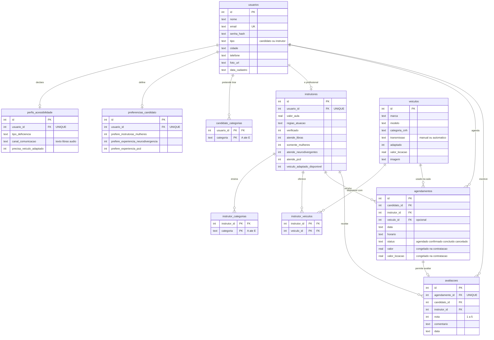

# Habilita+

Marketplace digital que conecta candidatos à Carteira Nacional de Habilitação (CNH) a
instrutores, instrutoras e autoescolas.

> **Democratizando o acesso à habilitação**

Web app mobile-first com PWA, desenvolvida como projeto acadêmico do curso de Análise e
Desenvolvimento de Sistemas.

## Diferenciais do produto

1. **Inclusão e acessibilidade** — filtro por profissionais que atendem em Libras, que têm
   experiência com pessoas neurodivergentes (TDAH, autismo, dislexia) e com pessoas com
   deficiência. O candidato declara suas necessidades no cadastro e elas viram filtros
   automáticos na busca.
2. **Filtro por instrutoras mulheres** — para candidatas que preferem realizar as aulas
   com profissionais mulheres.
3. **Transparência por avaliações** — ranking de 1 a 5 estrelas com comentários de alunos
   que efetivamente realizaram a aula.
4. **Locação de veículo adaptado** — cada profissional pode disponibilizar veículos para
   locação, incluindo modelos adaptados para pessoas com deficiência (preparado para uma
   futura parceria com locadora).

## Tecnologias

| Camada | Tecnologia |
|---|---|
| Linguagem | Python 3.12 |
| Framework web | Flask 3.0 |
| Banco de dados | SQLite (biblioteca `sqlite3` nativa, sem ORM) |
| Frontend | HTML + CSS puro com Jinja2 |
| Senhas | Hash scrypt via `werkzeug.security` |

O projeto usa SQL escrito à mão de propósito, como exercício de aprendizado de banco de
dados. Não há ORM.

## Como executar

### 1. Criar e ativar o ambiente virtual

```bash
python -m venv venv
```

Ativação no Windows (PowerShell):

```bash
.\venv\Scripts\Activate.ps1
```

No Linux ou macOS:

```bash
source venv/bin/activate
```

O ambiente virtual isola as bibliotecas deste projeto das bibliotecas globais do Python,
evitando conflito de versões com outros projetos.

### 2. Instalar as dependências

```bash
pip install -r requirements.txt
```

### 3. Criar o banco de dados e popular com dados de exemplo

```bash
python database/init_db.py
python database/seed.py
```

O `init_db.py` apaga o banco existente e recria as tabelas a partir do `schema.sql`.
O `seed.py` pode ser executado quantas vezes quiser — ele limpa as tabelas antes de
inserir, então nunca duplica dados.

### 4. Rodar a aplicação

```bash
python run.py
```

Acesse `http://127.0.0.1:5000`.

### 5. Testar no celular (mesma rede Wi-Fi)

```bash
python -c "from app import create_app; create_app().run(host='0.0.0.0', port=5000)"
```

Descubra o IP do computador com `ipconfig` (Windows) ou `ip addr` (Linux), e acesse
`http://SEU_IP:5000` no celular.

## Contas de teste

Todas as contas do seed usam a senha **`senha123`**.

| E-mail | Tipo | Observação |
|---|---|---|
| `ana.paula@example.com` | Candidata | Surda, comunicação em Libras, prefere instrutoras mulheres |
| `mariana.costa@example.com` | Candidata | Categorias A e B |
| `pedro.henrique@example.com` | Candidato | Prefere profissionais com experiência em neurodivergência |
| `juliana.oliveira@habilitaplus.com` | Instrutora | 5 estrelas, R$ 90/aula, Libras, 5 veículos |
| `fernanda.souza@habilitaplus.com` | Instrutora | R$ 85/aula, sem avaliações ainda |
| `carlos.mendes@habilitaplus.com` | Instrutor | R$ 70/aula, 4 estrelas |
| `roberto.almeida@habilitaplus.com` | Instrutor | **Não verificado** — não aparece nas buscas |

## Modelo de dados

O banco tem 10 tabelas e contempla os três tipos de relacionamento: 1:1, 1:N e N:N.



**Como ler:** `||--o|` significa "um para zero-ou-um" (relação 1:1 opcional) e `||--o{`
significa "um para muitos". As tabelas `instrutor_categorias`, `candidato_categorias` e
`instrutor_veiculos` são **tabelas de junção**: existem apenas para guardar pares e têm
chave primária composta.

### `usuarios`
Tabela central. Guarda candidatos e profissionais na mesma estrutura, diferenciados pela
coluna `tipo` (`candidato` ou `instrutor`), restrita por `CHECK`. A senha é armazenada
apenas como hash. O `email` é `UNIQUE`, então o próprio banco impede cadastro duplicado.

### `perfis_acessibilidade`
Extensão opcional de `usuarios` (1:1 via `usuario_id UNIQUE`). Só ganha uma linha quando
a pessoa preenche a etapa de acessibilidade do cadastro — tipo de deficiência, canal de
comunicação preferido (texto, Libras ou áudio) e se precisa de veículo adaptado.
Ficou em tabela separada para não deixar colunas nulas em toda linha de `usuarios`.

### `preferencias_candidato` e `candidato_categorias`
Extensão opcional de `usuarios` para candidatos, com as três preferências de busca
(somente mulheres, experiência com neurodivergentes, experiência com PcD). São elas que a
tela de busca carrega automaticamente. As categorias de CNH pretendidas ficam na tabela
de junção `candidato_categorias`, uma linha por categoria.

### `instrutores` e `instrutor_categorias`
Extensão de `usuarios` para quem oferece aulas. Guarda valor da aula, região de atuação e
os atributos que alimentam os filtros: `atende_libras`, `somente_mulheres`,
`atende_neurodivergentes`, `atende_pcd` e `veiculo_adaptado_disponivel`. A coluna
`verificado` controla se o perfil recebe o selo — perfis novos aparecem nas buscas como
*Em análise*, ordenados após os verificados.

As categorias que o instrutor ensina ficam em `instrutor_categorias`, uma linha por
categoria. Essa tabela substituiu um campo de texto `"A,B"` que existia antes e violava a
1ª Forma Normal. Com ela, o filtro da busca passou de um `LIKE '%B%'` — que só funcionava
porque as categorias são letras únicas — para uma comparação exata via `EXISTS`.

### `veiculos` e `instrutor_veiculos`
Relacionamento **muitos-para-muitos**: um instrutor oferece vários veículos, e o mesmo
veículo é oferecido por vários instrutores. A tabela `instrutor_veiculos` existe só para
guardar os pares, e sua chave primária é composta — `PRIMARY KEY (instrutor_id, veiculo_id)`
— o que identifica a linha e impede vínculos duplicados de uma vez só.

### `agendamentos`
Uma linha por aula marcada. O `status` (`agendado`, `confirmado`, `concluido`,
`cancelado`) é restrito por `CHECK` e controla tanto a disponibilidade de horários quanto
a liberação da avaliação.

Um **índice parcial único** impede duas aulas ativas no mesmo instrutor, data e horário:

```sql
CREATE UNIQUE INDEX idx_agenda_ocupada
    ON agendamentos (instrutor_id, data, horario)
    WHERE status IN ('agendado', 'confirmado');
```

A cláusula `WHERE` é o que torna isso correto: sem ela, uma aula cancelada continuaria
ocupando o horário para sempre, já que a linha permanece na tabela. É essa constraint que
fecha a condição de corrida — dois candidatos clicando no mesmo instante não conseguem
mais reservar o mesmo horário, porque o segundo `INSERT` é recusado pelo banco.

Guarda `valor` e `valor_locacao` copiados no momento da contratação, e não apenas as
chaves estrangeiras. Isso é intencional: se o preço do instrutor ou da locação mudar
depois, os agendamentos antigos continuam registrando o que foi efetivamente combinado —
o mesmo princípio de uma nota fiscal.

### `avaliacoes`
Nota de 1 a 5 (restrita por `CHECK (nota BETWEEN 1 AND 5)`) mais comentário opcional.
O `agendamento_id` é `UNIQUE`, garantindo no máximo uma avaliação por aula realizada.

**A média de estrelas não é armazenada em lugar nenhum.** Ela é calculada com `AVG(nota)`
sempre que necessário. Guardar a média numa coluna criaria risco de o número ficar
desatualizado a cada nova avaliação; calculando na hora, é impossível ficar inconsistente.

## Telas

| # | Tela | Rota |
|---|---|---|
| 1 | Splash | `/` |
| 2 | Login | `/login` |
| 3 | Cadastro (tipo de conta) | `/cadastro` |
| 4 | Cadastro — dados pessoais | `/cadastro/dados` |
| 5 | Cadastro — categorias de CNH | `/cadastro/categoria` |
| 6 | Cadastro — preferências | `/cadastro/preferencias` |
| 7 | Cadastro — acessibilidade | `/cadastro/acessibilidade` |
| 8 | Cadastro — perfil profissional | `/cadastro/instrutor` |
| 9 | Home do candidato (destaques e minhas aulas) | `/home` |
| 9b | Painel do instrutor (agenda e indicadores) | `/home` |
| 10 | Busca com filtros | `/busca` |
| 10b | Minhas aulas (próximas, histórico, cancelamento) | `/minhas-aulas` |
| 11 | Perfil do instrutor | `/instrutor/<id>` |
| 12 | Agendamento (calendário, horário, veículo) | `/instrutor/<id>/agendar` |
| 13 | Confirmação | `/agendamento/confirmar` |
| 14 | Sucesso | `/agendamento/<id>/sucesso` |
| 15 | Avaliação pós-aula | `/agendamento/<id>/avaliar` |

O cadastro é um assistente de 4 etapas para candidatos e 2 etapas para profissionais. Os
dados ficam na sessão do Flask durante o preenchimento e só são gravados no banco na
última etapa — assim um cadastro abandonado no meio não deixa registro incompleto.

## Estrutura do projeto

```
habilita-plus/
├── app/
│   ├── __init__.py          fábrica da aplicação Flask
│   ├── constantes.py        cidades do ES, categorias, horários, meses
│   ├── routes/
│   │   ├── main.py          splash, home, service worker
│   │   ├── auth.py          login, logout, cadastro em etapas
│   │   ├── busca.py         busca com filtros dinâmicos
│   │   ├── instrutores.py   perfil público do profissional
│   │   ├── agendamentos.py  calendário, confirmação e sucesso
│   │   └── avaliacoes.py    avaliação pós-aula
│   ├── templates/           HTML com Jinja2
│   └── static/
│       ├── css/style.css    identidade visual completa
│       ├── icons/           ícones do PWA
│       ├── img/             fotos dos profissionais e veículos
│       ├── manifest.json    configuração do PWA
│       └── service-worker.js
├── database/
│   ├── schema.sql           definição das 7 tabelas
│   ├── db.py                conexão SQLite
│   ├── init_db.py           cria o banco
│   └── seed.py              popula com dados de exemplo
├── instance/habilita.db     o banco (gerado, não versionado)
├── requirements.txt
└── run.py
```

## Decisões técnicas relevantes

**Consultas parametrizadas em toda a aplicação.** Nenhum dado digitado pelo usuário é
concatenado na string SQL — sempre vai como parâmetro (`?`). É o que impede SQL Injection.
Na busca, as condições do `WHERE` são montadas dinamicamente conforme os filtros ativos,
mas apenas os nomes de coluna (escritos no código) entram na string; os valores seguem
separados.

**Chaves estrangeiras habilitadas explicitamente.** O SQLite não aplica `FOREIGN KEY` por
padrão, então toda conexão executa `PRAGMA foreign_keys = ON` (em `database/db.py`).

**Validação em camadas.** Regras como "e-mail único", "uma avaliação por aula" e "horário
não pode estar ocupado" são verificadas na interface, na rota e na constraint do banco.
As duas primeiras servem para dar mensagens claras; a do banco é a que realmente garante.

**Calendário sem JavaScript.** O calendário de agendamento é uma tabela HTML gerada pelo
módulo `calendar` do Python, e cada dia é um link comum. Funciona com o botão Voltar do
navegador e com leitores de tela — relevante num projeto cujo foco é acessibilidade.

## Acessibilidade

O projeto foi auditado contra as diretrizes WCAG 2.1 nível AA. Oito telas verificadas
(splash, login, cadastro, home, busca, perfil, agendamento e minhas aulas):

| Critério | Resultado |
|---|---|
| Contraste de texto (1.4.3 — mínimo 4.5:1) | 0 falhas |
| Alvos de toque (2.5.5 — mínimo 44×44px) | 0 falhas |
| Campos de formulário com rótulo (1.3.1, 3.3.2) | 0 falhas |
| Imagens com texto alternativo (1.1.1) | 0 falhas |
| Idioma da página declarado (3.1.1) | `lang="pt-BR"` |

Correções aplicadas durante a auditoria: a cor das estrelas foi escurecida de `#F59E0B`
para `#B45309` (o âmbar original dava apenas 2.15:1), os dias passados e horários ocupados
do calendário deixaram de usar cinza-claro ilegível, e links como *Ver todas* e *Ver
perfil* ganharam altura mínima de 44px.

A interface também declara `prefers-reduced-motion` para quem configurou o sistema
operacional para reduzir animações, e todo elemento focável tem contorno visível para
navegação por teclado.

## PWA

O aplicativo pode ser adicionado à tela inicial do celular com ícone próprio e abre em
tela cheia (`display: standalone`).

- `static/manifest.json` — nome, ícones (192, 512 e maskable), tema azul `#2563EB`
- `static/service-worker.js` — cache do CSS e ícones
- Meta tags de iOS (`apple-mobile-web-app-capable`, `apple-touch-icon`) em `base.html`

O service worker é servido pela rota `/service-worker.js` (e não diretamente de
`/static/`) porque um service worker só controla páginas dentro da pasta de onde é
servido — da raiz, ele cobre o site inteiro.

**Instalação:** no Android/Chrome, menu ⋮ → "Adicionar à tela inicial". No iPhone/Safari,
botão Compartilhar → "Adicionar à Tela de Início".

## Publicação com HTTPS (PythonAnywhere)

O PWA só instala de verdade em HTTPS. O PythonAnywhere tem plano gratuito com HTTPS
incluso e disco persistente — importante aqui, porque o banco é um arquivo SQLite (em
serviços com disco efêmero, como o plano gratuito do Render, o banco seria apagado a cada
reinício).

O projeto já está preparado: existe o `wsgi.py`, e a `SECRET_KEY` é lida da variável de
ambiente `HABILITA_SECRET_KEY`.

### 1. Criar a conta

Crie uma conta gratuita ("Beginner") em [pythonanywhere.com](https://www.pythonanywhere.com).
O endereço final será `https://SEUUSUARIO.pythonanywhere.com`.

### 2. Enviar o projeto

No painel, abra um **Bash console** e clone o repositório:

```bash
git clone https://github.com/Kaiocorreia/habilita-plus.git
cd habilita-plus
```

### 3. Criar o ambiente virtual e instalar

```bash
mkvirtualenv habilita --python=python3.10
pip install -r requirements.txt
```

Anote o caminho que o console mostrar (algo como `/home/SEUUSUARIO/.virtualenvs/habilita`).

### 4. Criar o banco

```bash
python database/init_db.py
python database/seed.py
```

### 5. Configurar a aplicação web

Na aba **Web**, clique em *Add a new web app* → *Manual configuration* → *Python 3.10*.
Depois preencha:

| Campo | Valor |
|---|---|
| Source code | `/home/SEUUSUARIO/habilita-plus` |
| Virtualenv | `/home/SEUUSUARIO/.virtualenvs/habilita` |

Em **Static files**, adicione:

| URL | Directory |
|---|---|
| `/static/` | `/home/SEUUSUARIO/habilita-plus/app/static/` |

### 6. Editar o arquivo WSGI

Clique no link do *WSGI configuration file*, apague todo o conteúdo e coloque:

```python
import os
import sys

caminho = "/home/SEUUSUARIO/habilita-plus"
if caminho not in sys.path:
    sys.path.insert(0, caminho)

os.environ["HABILITA_SECRET_KEY"] = "cole-aqui-uma-chave-aleatoria-longa"

from wsgi import application
```

Para gerar a chave, rode no console Bash:

```bash
python -c "import secrets; print(secrets.token_hex(32))"
```

Sem essa variável o site funciona, mas todo mundo é deslogado a cada reinício do servidor.

### 7. Publicar

Volte à aba **Web** e clique no botão verde **Reload**. O site estará em
`https://SEUUSUARIO.pythonanywhere.com` — com HTTPS, e o PWA já instalável pelo celular.

### Atualizando depois

Quando o código mudar aqui no computador, envie para o GitHub:

```bash
git add -A && git commit -m "descricao da mudanca" && git push
```

E no console do PythonAnywhere:

```bash
cd ~/habilita-plus && git pull
```

Depois clique em **Reload** na aba Web.

> O `git pull` traz só o código. O banco (`instance/habilita.db`) fica de fora do
> versionamento de propósito — o do servidor é independente do seu, e os cadastros feitos
> no site publicado não são apagados por um `git pull`. Só rode `init_db.py` lá de novo se
> quiser mesmo zerar tudo (o `schema.sql` tiver mudado, por exemplo).

## Repositório

O código está em **https://github.com/Kaiocorreia/habilita-plus**

## Limitações conhecidas

Pontos deixados em aberto conscientemente, por estarem fora do escopo desta fase:

- **PWA completo exige HTTPS.** Navegadores só ativam service worker e o prompt de
  instalação em HTTPS (`localhost` é a única exceção). Acessando pelo IP local em HTTP, o
  "Adicionar à tela inicial" geralmente funciona, mas a instalação completa não. Veja a
  seção *Publicação com HTTPS* para resolver isso.
- **Instrutor não define disponibilidade.** Todos os profissionais oferecem a mesma grade
  fixa de horários (07:00–17:00). O passo natural seria uma tabela `disponibilidades`.
- **Sem busca por nome.** Os filtros cobrem cidade, categoria, preço, avaliação e
  acessibilidade, mas não há campo de texto livre.
- **Painel do instrutor é somente leitura.** Ele vê a própria agenda, a nota e o total de
  aulas dadas, mas ainda não edita o perfil nem define horários de disponibilidade.
- **Verificação de perfil não tem fluxo de aprovação.** Perfis novos aparecem nas buscas
  marcados como *Em análise* e ordenados depois dos verificados; a promoção para
  `verificado = 1` precisa ser feita direto no banco, sem tela de administração.
- **Pagamento fora do app**, combinado diretamente com o profissional.

## Créditos das imagens

- **Fotos dos profissionais:** retratos do serviço [randomuser.me](https://randomuser.me),
  disponibilizados para uso em protótipos de interface. São imagens de demonstração — para
  usar o sistema em produção, cada profissional deve enviar a própria foto.
- **Ilustrações dos veículos:** SVGs criados especificamente para este projeto, sem uso de
  imagens de terceiros.

Para trocar qualquer imagem, basta substituir o arquivo em `static/img/` ou atualizar a
coluna correspondente no banco (`usuarios.foto_url` ou `veiculos.imagem`).
